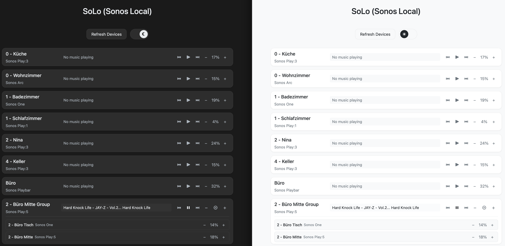

# SoLo (Sonos Local) 🔊

A modern, responsive web interface for controlling your local Sonos speakers.
Control playback, manage groups, and adjust volume with a clean, intuitive UI.

## Features

- Play/pause and track control
- Individual and group volume control
- Group management (create/leave groups)
- Light/dark theme support
- Responsive design for all devices
- Real-time status updates

## Screenshots



## Getting Started

### Prerequisites

- Python 3.7+
- Sonos speakers on your local network
- [uv](https://github.com/astral-sh/uv) for dependency management

### Installation

1. Clone the repository:
```bash
git clone https://github.com/armintoepfer/solo.git
cd solo
```

2. Install dependencies with uv:
```bash
uv venv
source .venv/bin/activate  # On Unix/macOS
# or
.venv\Scripts\activate     # On Windows

uv pip install -r requirements.txt
```

3. Run the application:
```bash
python app.py
```

4. Open your browser and navigate to:
```
http://localhost:5000
```

## License

This project is dedicated to the public domain under the Unlicense. You can do
whatever you want with it, no attribution required.

## Acknowledgments

Thanks to Sonos for their UPnP/SOAP API.
